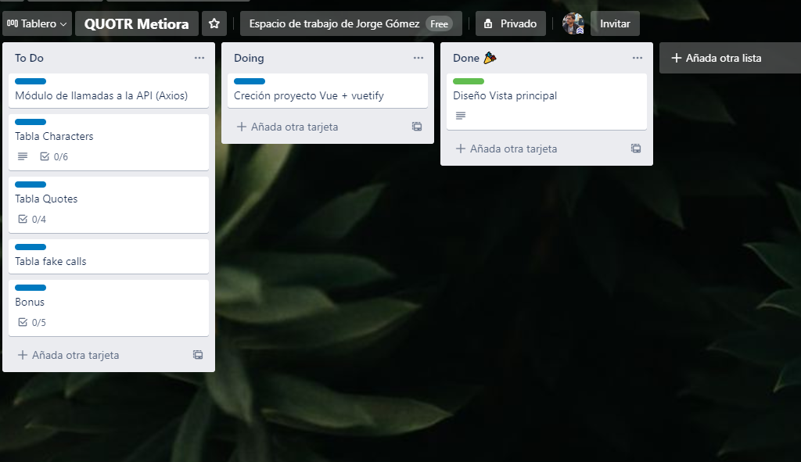

# Quotr
Quotr(Quotes of the ring), es una aplicación web desarrollada por Jorge Gómez (https://github.com/Jorgegomezb/) Para el proceso de seleccion de Metiora.

Secciones del Readme:
* [Análisis del problema](#an-lisis-del-problema)
* [Estructura del código](#estructura-del-c-digo)
* [Componentes](#componentes)
* [Instalación y ejecución en local](#instalaci-n-y-ejecuci-n-en-local)
 * [Known Issues](#known-issues)

## Análisis del problema
Se nos pide hacer un frontal con varias tablas, que muestren la información que reciben de una API. En total se nos piden 3 tablas, con comunicaciones varias entre ellas.

**Planificacion**




-Tras la lectura de requisitos se genera un tablero tipo kanban con los tickets que se creen necesarios (imagen) 
-Se irá por orden de prioridad realizando cada uno de ellos
-Una vez terminados los tickets se limpiará el código y se creará la documentación.


## Estructura del código
El codigo estará estructurado de la siguiente manera:

📦src  
 ┣ 📂components  
 ┃ ┣ 📂FilterSelects  
 ┃ ┃ ┗ 📜Selector.vue  
 ┃ ┣ 📜DataTable.vue  
 ┃ ┣ 📜EventDialog.vue  
 ┃ ┗ 📜PageTitle.vue  
 ┣ 📂utils  
 ┃ ┣ 📜APIConstants.js  
 ┃ ┣ 📜APIHandler.js  
 ┃ ┗ 📜functions.js  
 ┣ 📜App.vue  
 ┗ 📜main.js


## Componentes
El frontal posee varios componentes, que se han creado de la forma más genérica posible, con el fin de poder reutilizarlos si la aplicación escala.
Estos son:

 - **APP**: Componente base del proyecto, contiene todos los demás componentes y maneja la comunicación entre ellos. Además es el encargado de generar los strings de los endpoints según las necesidades.
 - **DataTable**: Tabla de datos con varias propiedades de configuración:
	 - tableData: Datos que mostrar en la tabla
	 - table_title: Título que se mostrará en la tabla
	 - MonoFilter Label: etiqueta para los filtros monoseleccion
	 - multiFilterLabel: etiqueta para los filtros multiselección
	 - MonoFilterOptions: Array con las opciones para los filtros monoseleccion
	 - totalData: Numero de datos que mostrar
	 - CharacterName: Nombre que se mostrará concatenado con el título(cuando se seleccione un peronsaje, su nombre aparecerá en el titulo de la tabla de citas)
	 - hasActions: Booleano que define si la tabla tiene acciones o no
	 - SortHeader:Columna por la que ordena los datos.
 - **Selector**: Componente tipo select, con varias propiedades:
	 - options: Array de opciones a mostrar
	 - label: Etiqueta a mostrar 
	 - Multiple: Define si es filtro mono seleccion o multiseleccion
	 - Disable: Activa o desactiva el input
 - **EventDialog**: Diálogo de popup que salta cuando realizamos alguna accion sobre la tabla. Recibe un objeto tipo json y lo muestra en modo lista.

## Instalación y ejecución en local
Se trata de un proyecto de node sencillo, por lo que necesitaremos tener instalado node y npm
Para desplegar en local realizaremos los siguientes pasos:

```

npm install
npm run serve

```
Este proceso te lo sirve por defecto en localhost:8080.

## Known Issues
Tal y como está la API que se utiliza, no existen endpoints específicos para recibir datos como razas, o géneros disponibles, de tal manera que se ha optado por hacer éstos estáticos(en el caso del género), y dinámicos, en caso de la raza, según los datos que contenga la tabla en ese momento.


